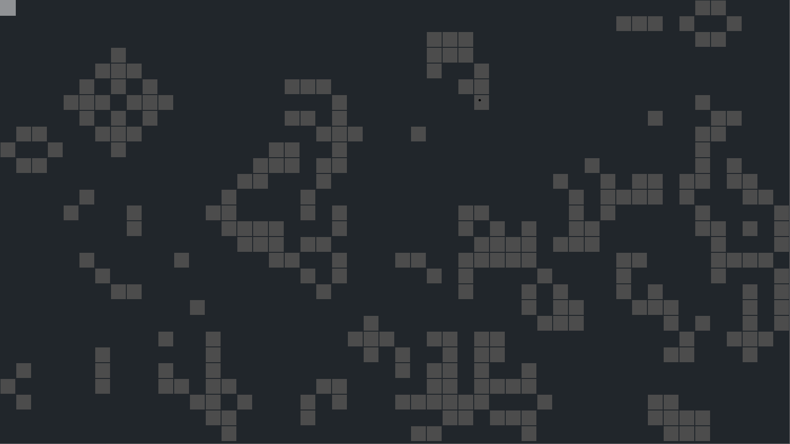

# gol

Conway's Game of Life in Love2d

---------------------------------

This is an old staple in gaming. Each round is considered a generation. Each generation, each cell evaluates its 8-directonal neighbors to determine if it lives, dies, or is born into the world.

### Rules ###

| Current State of Cell | # of Alive Neighbor Cells | New State     |
|:---------------------:|:-------------------------:|:-------------:|
| Alive                 | 0, 1, or 4+               | Dies          |
| Alive                 | 2 or 3                    | Survives      |
| Dead                  | 3                         | Resurrected   |

### Controls ###

| Control     | Effect                    |
|:-----------:|:-------------------------:|
| p           | toggles the debug overlay |
| space       | pause/un-pause simulation |
| q           | quits game                |
| mouse-click | add/remove cell           |

### Reference ###

[Conway's Game of Life on Wikipeidia](https://en.wikipedia.org/wiki/Conway%27s_Game_of_Life)
